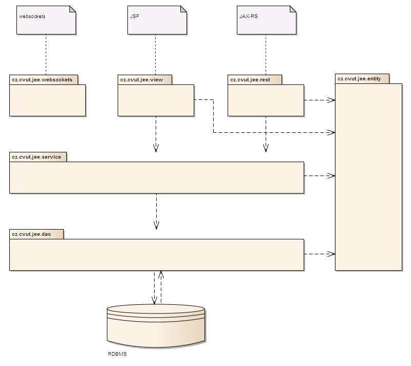

# A4M36JEE - Fix it! app #

## Vize projektu: ##
Aplikace slouží pro snadné nahlašování škod na veřejném majetku. Občan prostým kliknutím do mapy nahlásí incident a předá jej tak k řešení místně příslušnému městkému úřadu. Zde pověřený úředník pomocí webové aplikace škodu zanalyzuje a předá podmět k vyřešení nahlášeného incidentu.

## Pojmy ##
**Region** - geografická jednotka. Jednomu regionu přísluší právě jeden správní orgán (městký úřad), který nahlášené incidenty v daném místě řeší. Může to tedy být buď městská část (Praha 1), nebo celá obec (České Budějovice).

**Incident** - hlášená jednotka (např. černá skládka, škoda na veřejném majetku…)

## Funkční požadavky ##
#### Aplikace pro hlášení incidentů ####
* Zvolení lokace incidentu
* Vyplnění informací o hlášeném incidentu
* Odeslání incidentu na server
* Zobrazení všech incidentů
* Zobrazení detailu incidentu
* Veřejné REST API pro nahlášení incidentu, zobrazení všech incidentů a zobrazení detailu incidentu

#### Aplikace pro správu incidentů ####
* Přihlášení do systému
* Zobrazení všech incidentů
* Změna stavu incidentu
* Přidání vyjádření k incidentu
* Noční zpracování nevalidních incidentů (vytvoření statistiky)

## Ostatní požadavky ##
* Systém bude rozlišovat 4 úrovně oprávnění (každá další role v seznamu automaticky přebírá oprávnění všech rolí vyjmenovaných dříve)
 * **Nepřihlášený uživatel** - přidává a zobrazuje nahlášené incidenty
 * **Úředník (OFFICER)** - v rámci svého regionu řeší nahlášné incidenty (změna stavu, přidání vyjádření)
 * **Regionální admin (REGION_ADMIN)** - spravuje úředníky v rámci svého regionu
 * **Super admin (SUPER_ADMIN)** - spravuje regiony a jejich regionální adminy
* Aplikace bude nasazena na OpenShiftu
* Aplikace bude testovatelná
* Aplikaci bude možné nasadit v clusteru dvou uzlů v doménové konfiguraci
* Aplikace bude vystavovat veřejné REST API pro komunikaci mezi systémy

## Architektura ##
Architektura samotné aplikace sestává z vrstev doporučovaných pro typickou aplikaci psanou ve frameworku Spring. Ke standardní třívrstvé architektuře JEE aplikací tedy navíc přidává i DAO vrstvu. 

*Poznámka autora: O tomto architektonickém rozhodnutí rád rozpoutám debatu. Stejně tak rád povedu debatu na téma, zda je pro EJB servicy vhodné a doporučené psát interfacy, pokud je již od začátku zjevné, že existovat bude stejně jen jedna implementace. Z tohoto důvodu je v aplikaci  zcela záměrně u tříd servisní vrstvy použito interfaců, zatímco u DAO vrstvy interfacy chybí.*




### Datový model ###


## Použité technologie ##
* Aplikační server WildFly 8.1
* Maven 3.2
* EJB 3.2
* CDI	1.1
* JPA 2.1
* Hibernate validator 5.0.1
* JAX-RS 2.0
* JSF 2.2
* Batching API 1.0
* Arquillian 1.1.5
* TestNG 6.8
* SLF4J 1.7.7
* PostgreSQL

## Rozšiřitelnost do budoucna ##
Na aplikaci je samozřejmě stále co zlepšovat. Již nyní jsou nám známy vhodná rozšíření stávající implementace:
* Možnost přidávat obrázky hlášených incidentů
* Tvorba mobilních aplikací, které se budou připojovat na veřejné REST API a pomocí kterých bude možné nahlašovat incidenty z mobilních zařízení

## Příprava projektu: ##

* příprava projektu je relevantní pro aplikační server **WildFly-8.1.0.Final**

### Nastavení databáze ###

* nejdřív spustíme server ve standalone módu

  ``./bin/standalone.sh``

* připojíme se na cli konzoli

  ``./bin/jboss-cli.sh --connect``

* přidáme postgresql .jar aby ho měl WF k dispozici (cestu v resources nahradíme cestou kde máme stažený .jar)

  ``module add --name=org.postgresql --resources=~/Downloads/postgresql-9.1-903.jdbc4.jar --dependencies=javax.api,javax.transaction.api``

* přidáme jdbc driver

  ``/subsystem=datasources/jdbc-driver=postgresql:add(driver-name=postgresql,driver-module-name=org.postgresql,driver-xa-datasource-class-name=org.postgresql.xa.PGXADataSource)``
  
* pokud proběhl cli script správně, ve *standalone.xml* se nám objeví nově přidaný driver:

  ```xml
  <driver name="postgresql" module="org.postgresql">
    <xa-datasource-class>org.postgresql.xa.PGXADataSource</xa-datasource-class>
  </driver>
  ```

* nakonec musíme přidat vlastní datasource. Nějak se mi to v WF 8.1 nepodařilo nastavit přes cli tak to přidáme rovnou do *standalone.xml*. Přijde to do ``<datasources>`` a samozřejmě si případně jednotlivé atributy změníme. Před úpravou *standalone.xml* je žádoucí server vypnout.

  ```xml
  <xa-datasource jndi-name="java:jboss/datasources/AppXADS" pool-name="AppXADS" enabled="true">
    <xa-datasource-property name="ServerName">
        localhost
    </xa-datasource-property>
    <xa-datasource-property name="PortNumber">
        5432
    </xa-datasource-property>
    <xa-datasource-property name="DatabaseName">
        fixit
    </xa-datasource-property>
    <driver>postgresql</driver>
    <xa-pool>
        <min-pool-size>10</min-pool-size>
        <max-pool-size>25</max-pool-size>
        <prefill>true</prefill>
    </xa-pool>
    <security>
        <user-name>postgres</user-name>
        <password>postgres</password>
    </security>
  </xa-datasource>
  ```


### Nastavení security-domain ###

* do *standalone.xml* přidáme na příslušné místo

  ```xml
  <security-domain name="fixitapp-jaas-realm">
    <authentication>
        <login-module code="Database" flag="required">
            <module-option name="dsJndiName" value="java:jboss/datasources/AppXADS"/>
            <module-option name="principalsQuery" value="select password from person where username=?"/>
            <module-option name="rolesQuery" value="select role, 'Roles' from person where username=?"/>
            <module-option name="hashAlgorithm" value="SHA-256"/>
            <module-option name="hashEncoding" value="base64"/>
        </login-module>
    </authentication>
  </security-domain>
  ```
  
## Příprava projektu pro běh v clusteru: ##

* nastavení probíhá zcela totožně, jako je popsané v návodu výše, jediný rozdíl je, že nekonfigurujeme *standalone.xml* ale **standalone-ha.xml**

* v našem případě (již máme přidaný modul postgre) tedy pouze do *standalone-ha.xml* přidáme na příslušná místa *postgre driver*, náš *xa-datasource* a naší *security-domain*

* nyní si vytvoříme druhou instanci *wildfly* serveru (fyzicky druhou kopii). Konfigurační *standalone-ha.xml* do nové instance zkopírujeme z prvního serveru

* .war naší nasazované aplikace zkopírujeme na oba servery
  ```
  cp target/fixapp.war WF-1/standalone/deployments
  cp target/fixapp.war WF-2/standalone/deployments
  ```
  
* zbývá oba server spustit
  ```
  WF-1/bin/standalone.sh -c standalone-ha.xml -Djboss.node.name=`whoami`
  WF-2/bin/standalone.sh -c standalone-ha.xml -Djboss.socket.binding.port-offset=100 -Djboss.node.name=`whoami`2
  ```

* defaultně nyní aplikace poběží na portech *8080* a *8180*

## Openshift ##
* aplikace je dostupná na: [http://fixapp-chaluja7.rhcloud.com/](http://fixapp-chaluja7.rhcloud.com/)
* zřízené účty pro přístup
 * [spravce@eos.cz, spravce] - SUPER_ADMIN
 * [region@eos.cz, region] - REGION_ADMIN
 * [officer@eos.cz, officer] - OFFICER
* [REST API](http://fixapp-chaluja7.rhcloud.com/api/v1/)
* [Dokumentace REST API na apiary](http://docs.fixapppublicapi.apiary.io/#)

  